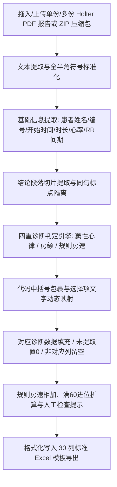
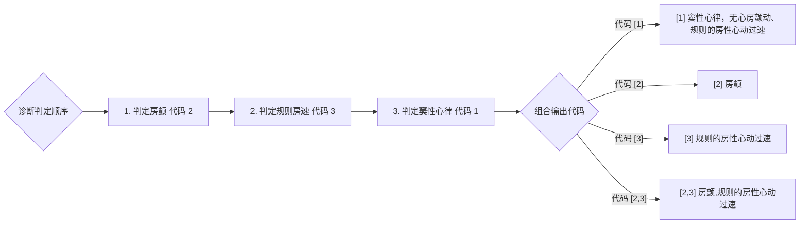
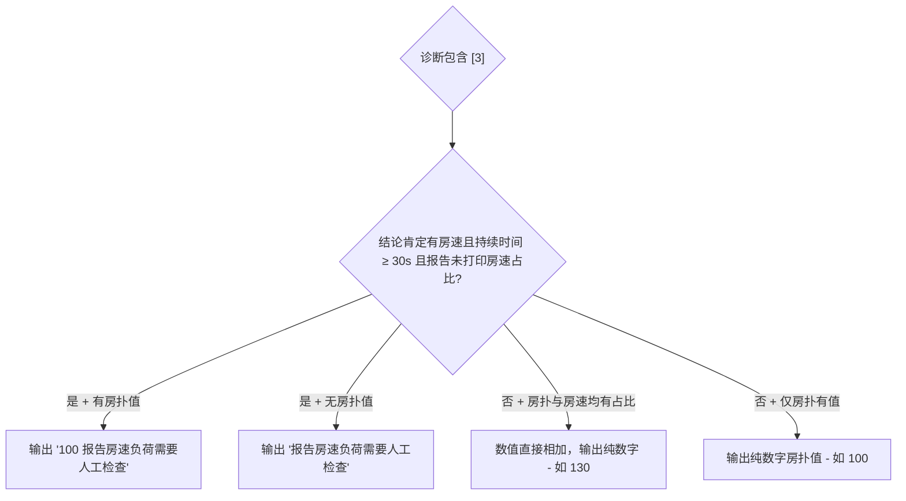

# 动态心电图报告 PDF 转 Excel 工具：全量系统逻辑说明报告（全覆盖版）

---

## 一、 系统架构与处理流程概览

本工具基于 Python 研发，集成了 `pdfplumber` 与 `pypdf` 高精度文本/标注解析引擎，实现了对动态心电图（Holter）PDF 报告的自动抓取、诊断逻辑判定、时间进位换算以及标准化 Excel 30 列数据的导出。

---

## 二、 基础信息与通用心率指标提取规则

除了诊断判定外，系统对 PDF 报告顶部的患者基础信息与心率定量指标执行以下标准抓取规则：

| 字段代码 (`Key`) | 字段名称 | 提取与解析逻辑 | 单位 (`_U`) |
| :--- | :--- | :--- | :---: |
| `SUBJID` | 受试者编号/姓名 | 优先从 PDF 文件名中提取（如 `01005`），若未匹配则从 PDF 顶部 `用户姓名` / `患者姓名` 标签后匹配 | - |
| `ECGSTDAT` | 检查开始时间 | 从 `记录日期` 或 `检查开始时间` 标签后自动提取并标准化格式（如 `2025-10-22 11:17`） | - |
| `ECGDURH` / `ECGDURM` | 记录时长（时/分） | 从 `记录时间: HH:MM` 提取折算（如 `23:59` 拆分为 `23` 小时 `59` 分） | 小时 / 分 |
| `ECGANADURH` / `ECGANADURM` | 分析时长（时/分） | 从 `分析时间: HH:MM` 提取折算（如 `30:01` 拆分为 `30` 小时 `01` 分） | 小时 / 分 |
| `ECGHR` | 平均心率 | 从 `平均心率: XX(bpm)` 或 `平均心率: XX（bpm）` 提取纯数字 | bpm |
| `ECGHRMAX` | 最大心率 | 从 `最大心率: XX(bpm)` 或 `最快心率: XX(bpm)` 提取纯数字 | bpm |
| `ECGHRMIN` | 最小心率 | 从 `最小心率: XX(bpm)` 或 `最慢心率: XX(bpm)` 提取纯数字 | bpm |
| `ECGRR` | 最长 RR 间期 | 从 `最大RR间期: XX毫秒` 或 `最长R-R间期: XXms` 提取纯数字 | ms |

---

## 三、 核心切片与否定词隔离规则

### 1. 结论切片范围界定
系统自动在 PDF 报告中定位**“结论”**关键字，抓取从 `结论` 至 `24小时数据图`（或 `24小时散点图` / `24小时趋势图` / `报告医生` / `文件结尾`）之间的区域作为核心诊断依据切片。

### 2. 同句标点隔离与否定/提醒词拦截
为了防止否定词（如“未见”）跨行吞噬后续正常的诊断描述，否定词正则限制在**同一标点符号或换行符内部**生效（采用 `[^，,；;。\n\d]*?` 隔离）：

- **否定拦截词库**：`未见`、`无`、`未发现`、`未检测到`、`不伴`、`否认`、`未出现`、`无明显`；
- **警告提醒拦截词库**（拦截非确诊）：`不排除`、`排除`、`待排`、`疑为`、`疑似`。

*示例*：报告写有 `1、窦性心律 ... 3、未见室性早搏 ... 6、窦性心动过缓`，第 3 行的“未见”会被句号阻断在第 3 行，第 1 行与第 6 行的窦性心律/心动正常生效。

---

## 四、 检查结果 (`ECGORRES`) 诊断判定四重核心规则

导出的诊断代码统一使用**半角中括号包裹**，并映射对应的选择项文字：

### 1. 规则 2：房颤（输出 `[2]`）
满足以下任意一条即判定为房颤：
1. 结论切片中明确包含 `心房颤动` 或 `房颤`，且未被否定词或不排除警告词修饰；
2. 定量表单中提取到房颤心搏数 `af_beats > 0` 或房颤负荷 > 0。

### 2. 规则 3：规则的房性心动过速（输出 `[3]`）
满足以下任意一条即判定为规则的房性心动过速：
1. 结论切片中包含 `心房扑动` 或 `房扑`，或定量表单中 `fl_beats > 0` / `fl_burden > 0`；
2. 结论切片或定量表单中包含 `房性心动过速` / `房速` / `室上速`，且**最长持续时间 $\ge 30\text{s}$**（最长持续时间限定在结论的房速专属语句切片中提取）。

### 3. 规则 1：窦性心律（输出 `[1]`）
必须同时满足以下条件：
1. 结论切片中包含 `窦性心律`、`窦性心动`（防错涵盖过缓/过速）或 `起搏心律`；
2. 未被否定词修饰；
3. 未选择代码 `2` 且未选择代码 `3`；
4. 房速最长持续时间 $< 30\text{s}$。

### 4. 复合多选组合（输出 `[2,3]`）
当同一份报告同时满足代码 `2`（房颤）与代码 `3`（规则房速）时，诊断代码导出为 **`"[2,3]"`**，选择项文字导出为 **`"房颤,规则的房性心动过速"`**。

---

## 五、 跨列数据空值/置 0 与格式控制规则

根据导出的诊断代码，严格控制房颤组列与规则心动过速组列的输出：

| 导出诊断代码 | 房颤组列 (`ECGAFBURD` / `ECGAFDUR`) | 规则心动过速组列 (`ECGATBURD` / `ECGATDUR`) |
| :---: | :---: | :---: |
| **`[1]`**（窦性心律） | **数据与单位全量留空 `""`** | **数据与单位全量留空 `""`** |
| **`[2]`**（房颤） | 有值显示纯数字，未提取到**数据填 `"0"`**（单位保留） | **数据与单位全量留空 `""`** |
| **`[3]`**（规则房速） | **数据与单位全量留空 `""`** | 有值显示纯数字/合并值，未提取到**数据填 `"0"`**（单位保留） |
| **`[2,3]`**（复合多选） | 有值显示纯数字，未提取到数据填 `"0"` | 有值显示纯数字/合并值，未提取到数据填 `"0"` |

> 📌 **纯数字原则**：所有数据单元格中**只包含纯数字/纯文本**（例如 `130`、`29`），不混入 `%`、`小时`、`分`、`秒` 等单位符号（单位统一在对应的 `_U` 单位列中声明）。

---

## 六、 规则心动过速合并与“人工检查”提示规则

### 1. 持续时间相加与满 60 进位转换（秒 ➔ 分 ➔ 小时）
当室上速（房速）与房扑同时存在时，其持续时间按以下规则累加并自动折算进位：
- **秒数相加进位**：室上速秒数与房扑秒数相加后满 60 秒，自动进位 1 到“分”（余数留在秒）；
- **分钟相加进位**：分钟数相加（含秒进位）后满 60 分，自动进位 1 到“小时”（余数留在分）；
- **小时数累加**：自动累加原小时数及分钟进位的小时数。

### 2. 房速负荷取消自动计算与人工检查提示触发机制
取消通过公式推算房速占比的代码，严格抓取报告原生打印占比。当诊断结果包含 **`"[3]"`** 时：

---

## 七、 全局全半角符号通用化兼容

全量正则表达式均已实现全角与半角符号的无缝双重兼容：

1. **括号通用化**：同时支持全角 `（` `）` 与半角 `(` `)`；
2. **单位通用化**：`[(（]次[)）]?`、`[(（]%[)）]?`、`[(（]bpm[)）]?`、`[(（]阵[)）]?`；
3. **标点通用化**：中文冒号 `：` / 英文冒号 `:`、中文逗号 `，` / 英文逗号 `,`、百分号 `%` / `％`；
4. **时间表达通用化**：全面支持 `最长持续时间` / `最长时间` / `最长一阵` / `持续时间` 等词组与 `99s` / `99秒` / `01:39` / `1分39秒` 等时间格式。

---

## 八、 Excel 模板写入与排版输出控制

为保障导出数据的严格美观与标准化，Excel 写入引擎执行以下排版规则：
1. **行起始识别**：自动识别空模板行，默认直接覆盖写在第 3 行样例行（保留第 1、2 行表头定义）；
2. **字体与颜色**：统一设置为**等线 11 号字、非粗体、纯黑色字体 (`color='000000'`)**；
3. **边框控制**：单元格全量添加**黑色薄边框 (`thin border`)**；
4. **对齐控制**：`ECGORRES_OPT`（选择项文字）自动采用**居左垂直居中、自动换行对齐**，其余所有数据列采用**居中对齐**。

---

## 九、 批量上传与 1:1 Excel 打包导出系统 (`app.py`)

1. **多 Zip 拖拽解析**：支持前端拖入单份或多份 ZIP 压缩包；
2. **1:1 独立生成**：每个上传的 ZIP 压缩包在后台独立解析并 1:1 生成同名的 Excel 结果文件（如 `安贞报告.zip` ➜ `安贞报告.xlsx`）；
3. **绿化与免安装部署**：系统封装为绿色免安装桌面环境（内置 Python 运行时与批处理 `start_win.bat`），解压即用。

---

## 十、 全量测试验证结果

在对 **1014 份安贞 Holter PDF 报告** 的全量跑通测试中：
- **解析成功率**：**100.00% (1014/1014)**；
- **异常崩溃数**：**0 份**；
- **受试者编号/开始时间/心率**：**0 缺失**；
- **未命中规则 (`/`)**：**0 份**。
